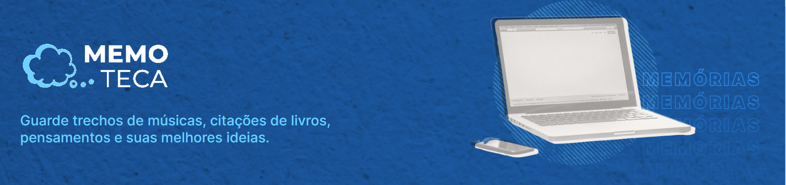
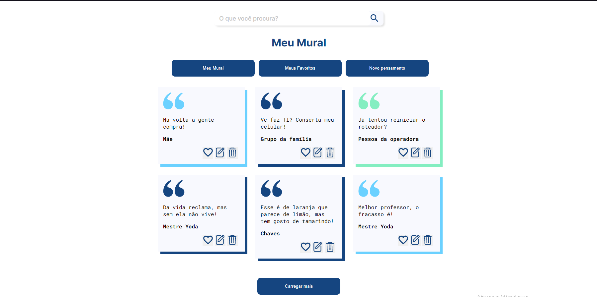
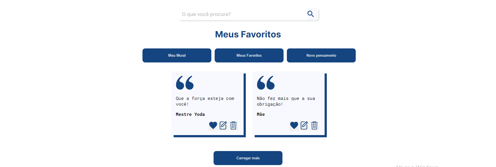
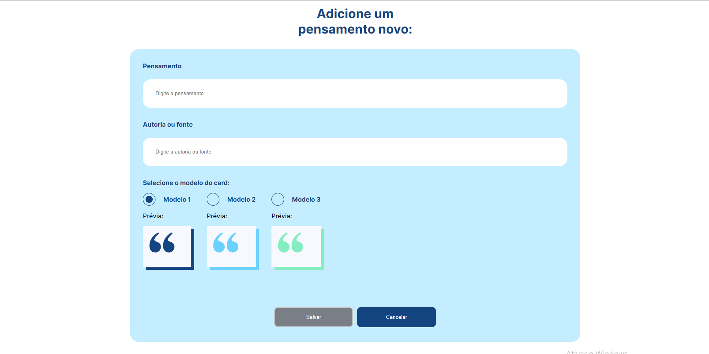
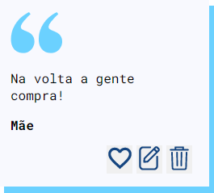

# Projeto Memoteca



O projeto memoteca é um site que exibe cards de pensamentos, você pode criar um clicando no 'novo pensamento' e salvar-lo no mural junto com os demais cards.

## Índice 
- <a href="#tecnologias-utilizadas">Tecnologias utilizadas</a>
- <a href="#proposito">Propósito</a>
- <a href="#funcionalidades-do-projeto">Funcionalidades do Projeto</a>
- <a href="#layout">Layout</a>
- <a href="#projeto">Projeto</a>
- <a href="#como-rodar-o-projeto">Como rodar o projeto</a>
- <a href="#autores">Autores</a>

## 📱Tecnologias utilizadas
1. [Angular](https://angular.io/cli)

## 🎯Propósito
O propósito deste projeto em Angular é permitir uma experiência de aprendizado prático e abrangente do framework Angular. Foi criado como um projeto acadêmico em colaboração com a Alura, com o objetivo de explorar e dominar os conceitos essenciais do Angular.

Durante o desenvolvimento deste projeto, adquiri conhecimentos fundamentais sobre o funcionamento do Angular, incluindo a compreensão das diretivas, injeção de dependências, manipulação de requisições HTTP no Angular, implementação de validações em formulários, configuração de rotas e muito mais.

Este projeto foi uma oportunidade valiosa para aprimorar minhas habilidades no desenvolvimento Angular e obter uma compreensão aprofundada de seus recursos e práticas recomendadas.

## 🖥Funcionalidades do Projeto

✔ Cards persolnalizados e em cada card se pode favoritar, editar e exluir o card.<br>
✔ Criar um card novo.<br>
✔ Exibir todos os cards.<br>
✔ Exibir somente os cards favoritos.<br>
✔ Campo de busca para filtrar os cards.<br>
✔ Carregamento dinâmico dos cards.<br>
✔ Validações no formulário de cadastrar, editar um novo card.

## 🧩Layout






## 🎮Projeto
➡  [link do projeto](https://memoteca-murex.vercel.app/listarPensamento) ⬅

## ⚠Como Rodar o Projeto
```bash
# Clone este repositório
$ git clone https://github.com/Jonas-Sousa/memoteca.git

# Acesse a pasta do projeto no seu terminal
$ cd memoteca

# Instale as dependências
$ npm install

# Execute a aplicação
$ ng serve
```
## 😎Autores 

  <br>
  <p>Jonas Sousa</p>
  
  
  [Linkedin](https://www.linkedin.com/in/jonas-sousa-dev/)


